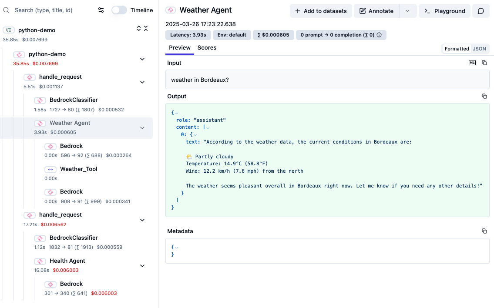

# Multi-Agent Orchestrator (MAO) with Langfuse

A demonstration project for orchestrating multiple AI agents using AWS Bedrock with integrated observability through Langfuse.

## Overview

This project demonstrates a multi-agent system that can:
- Classify user requests and route them to the appropriate specialized agent
- Stream responses from agents when applicable
- Provide weather information using a dedicated Weather Tool
- Log and track all interactions and agent selections using Langfuse observability

The system includes specialized agents for:
- Technology (software, hardware, AI, cybersecurity, etc.)
- Health and wellbeing
- Weather conditions (with tool integration)

## Prerequisites

- Python 3.11+
- AWS account with Bedrock access
- Langfuse account
- Environment variables configured

## Installation

1. Clone the repository:
```bash
git clone https://github.com/awslabs/multi-agent-orchestrator.git
cd examples/langfuse-demo
```

2. Create and activate a virtual environment:
```bash
python -m venv venv
source venv/bin/activate  # On Windows: venv\Scripts\activate
```

3. Install the required packages:
```bash
pip install -r requirements.txt
```

4. Set up your environment variables in a `.env` file:
```
# Langfuse credentials
LANGFUSE_PUBLIC_KEY=your_langfuse_public_key
LANGFUSE_SECRET_KEY=your_langfuse_secret_key
LANGFUSE_HOST=https://cloud.langfuse.com  # Or your self-hosted URL

# AWS credentials
AWS_ACCESS_KEY_ID=your_aws_access_key
AWS_SECRET_ACCESS_KEY=your_aws_secret_key
AWS_DEFAULREGION=your_aws_region
```

## Project Structure

```
├── main.py                 # Main application entry point
├── tools/
│   └── weather_tool.py     # Weather tool implementation
├── .env                    # Environment variables (not in repository)
├── trace.png               # Example of a Lgnfuse trace
└── README.md               # This file
```

## Usage

Run the application with:

```bash
python main.py
```

The system will start an interactive session where you can input queries. The orchestrator will:

1. Classify your query using Claude 3 Haiku
2. Route it to the appropriate specialized agent (Tech, Health, or Weather)
3. Return the response from the specialized agent
4. Log the entire interaction flow to Langfuse

Type `quit` to exit the application.

## Trace example



## Agent Capabilities

### Tech Agent
- Specializes in technology topics including:
  - Software development
  - Hardware
  - AI/ML
  - Cybersecurity
  - Blockchain
  - Cloud computing
  - Technology pricing and costs

### Health Agent
- Handles queries related to health and wellbeing

### Weather Agent
- Provides weather conditions for specified locations
- Uses a custom weather tool to fetch real-time data
- Requires location information (city or coordinates)

## Langfuse Integration

This demo showcases comprehensive observability with Langfuse:

- Traces entire user conversations
- Spans for individual agent interactions
- Metrics for model usage and performance
- Detailed logging of:
  - Classification decisions
  - Agent selection confidence
  - Token usage
  - Response times

Access your Langfuse dashboard to analyze:
- Which agents are being used most frequently
- Classification accuracy
- Performance bottlenecks
- User interaction patterns
